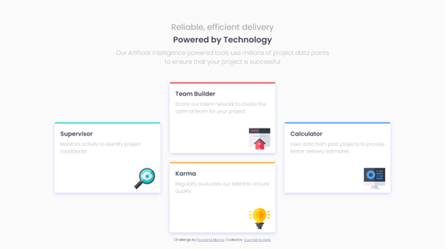

# Frontend Mentor - Four card feature section solution

This is a solution to the [Four card feature section challenge on Frontend Mentor](https://www.frontendmentor.io/challenges/four-card-feature-section-weK1eFYK). Frontend Mentor challenges help you improve your coding skills by building realistic projects. 

## Overview

### The challenge

Users should be able to:

- View the optimal layout for the site depending on their device's screen size

### Screenshot




### Links

- Solution URL: [https://github.com/toshirokubota/four-card-feature-section](https://github.com/toshirokubota/four-card-feature-section)
- Live Site URL: [https://toshirokubota.github.io/four-card-feature-section/](https://toshirokubota.github.io/four-card-feature-section/)

## My process

### Built with

- Semantic HTML5 markup
- CSS custom properties
- Flexbox
- Mobile-first workflow
- Reponsive typographs

### What I learned

I was able to use clamp() function with the viewport width to continuously resize the font sizes. One such example is 
```
    font-size: clamp(1rem, 0.8rem + 3vw, 3rem);
```
for h1 on the mobile version and
```
    font-size: clamp(1rem, 0.8rem + 1vw, 3rem);
```
for h1 on the desktop version.

### Continued development

I will keep working on responsive designs.

I also want to be more mindfull on internationalization of the web design. I have been using directional values like left and right, and want to start using logical counterparts of inline-start and inline-end, for example.

### Useful resources


## Author

- Frontend Mentor - [@toshirokubota](https://www.frontendmentor.io/profile/toshirokubota)

## Acknowledgments

